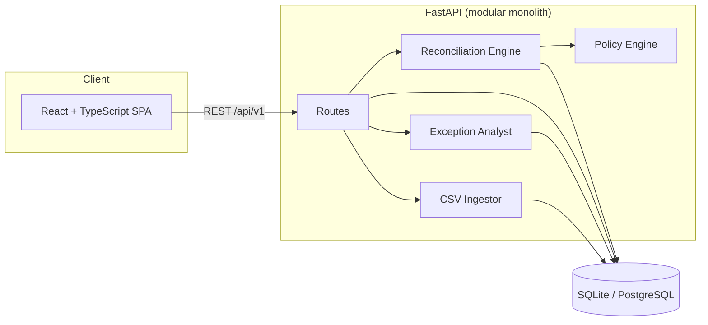

# AI Finance Controller

> Every rupee. Accounted for.

An open-source **finance operations control room** for reconciling payment events, gateway settlements, and bank credits. It pairs deterministic matching with policy-gated AI analysis and a human-in-the-loop review queue, so automation never outruns accountability.

The core principle:

> **AI proposes. Policy gates. Humans decide.**

[](https://fastapi.tiangolo.com)
[](https://react.dev)
[](https://www.typescriptlang.org)
[](https://www.python.org)
[](https://www.postgresql.org)
[](#license)

---

## Table of Contents

- [Overview](#overview)
- [Key Features](#key-features)
- [How It Works](#how-it-works)
- [Architecture](#architecture)
- [Tech Stack](#tech-stack)
- [Project Structure](#project-structure)
- [Quick Start](#quick-start)
  - [Option A: Docker (recommended)](#option-a-docker-recommended)
  - [Option B: Local Development](#option-b-local-development)
- [Configuration](#configuration)
- [Using the App](#using-the-app)
- [CSV Ingestion](#csv-ingestion)
- [Reconciliation & Policy Logic](#reconciliation--policy-logic)
- [API Reference](#api-reference)
- [Testing](#testing)
- [Deployment](#deployment)
- [Roadmap](#roadmap)
- [Contributing](#contributing)
- [License](#license)

---

## Overview

Reconciling money that moves through multiple systems is error-prone. A payment is captured in one system, settled by a payment gateway (minus fees and tax), and credited to a bank account days later. Any mismatch — a missing credit, a fee discrepancy, a duplicate, a delayed settlement — becomes a financial exception that must be investigated.

**AI Finance Controller** turns that work into a repeatable control loop:

1. **Ingest** payment, settlement, and bank records (synthetic demo or CSV upload).
2. **Match deterministically** using exact references, fee-adjusted amounts, and tolerance rules.
3. **Score** the evidence on a transparent 0–1 confidence scale.
4. **Gate with policy** — auto-resolve only when confidence is high and value is within limits.
5. **Analyze** ambiguous exceptions with structured AI reasoning.
6. **Escalate** uncertain or high-value items to a human reviewer.
7. **Audit** every ingestion, reconciliation, and human decision.

It ships with a demo data generator, so you can run the entire control loop end-to-end in seconds with zero external services.

---

## Key Features

| Capability | Description |
| --- | --- |
| **Deterministic matching first** | Exact chain, fee-adjusted, and rule-based matching before any AI is involved. |
| **Transparent confidence scoring** | Weighted, explainable field-level scoring (`reference`, `amount`, `merchant`, `currency`, `date`). |
| **Policy engine** | Configurable thresholds for auto-resolve, review, high-risk, and high-value escalation. |
| **Structured AI analysis** | Schema-validated exception classification with cause, risk, and recommended action. |
| **Human-in-the-loop queue** | Approve or reject exceptions with a recorded reviewer comment. |
| **Demo data generator** | Labeled synthetic batches with missing, amount, and date anomalies. |
| **CSV ingestion + validation** | Required-column, amount, and date validation with persisted rejection rows. |
| **Full audit trail** | Immutable audit events for ingestion, reconciliation, and human decisions. |
| **Operational dashboard** | Amount at risk, reconciled value, match rate, resolution rate, and accuracy. |
| **Flexible storage** | SQLite for zero-setup local dev; PostgreSQL for production via `DATABASE_URL`. |
| **Containerized** | One-command startup with Docker Compose. |

---

## How It Works

The system escalates only as far as it needs to. Each layer adds cost, latency, and scrutiny.

```
┌───────────────────────────────────────────────────────────────┐
│  LAYER 1 · EXACT CHAIN          Reference + gross/net + date   │
│  LAYER 2 · FEE ADJUSTED         Gross less gateway fee & tax   │
│  LAYER 3 · RULE EVIDENCE        Merchant + currency + window   │
│  LAYER 4 · AI ANALYSIS          Structured reasoning on gaps   │
│  LAYER 5 · HUMAN CONTROL        Approve / reject with comment  │
└───────────────────────────────────────────────────────────────┘
```

- **Deterministic layers (1–3)** produce a confidence score from matched fields. A clean record scores `0.95+`.
- **Duplicate signals** subtract `35` points and force escalation.
- The **policy engine** then decides: `AUTO_RESOLVE`, `POLICY_REVIEW`, `HUMAN_REVIEW`, or `HIGH_RISK`.
- Anything not auto-resolved receives **structured AI analysis** and enters the **exception queue**.
- A human decision writes back to the reconciliation result and records an **audit event**.

---

## Architecture



The backend is intentionally a **modular monolith**: each concern has a clear boundary and can be extracted into a service or task queue later without changing the domain behavior.

---

## Tech Stack

| Layer | Technology |
| --- | --- |
| Frontend | React 19, TypeScript, Vite, `lucide-react` |
| Backend | FastAPI, Pydantic, SQLAlchemy 2.0, Uvicorn |
| Database | SQLite (default) or PostgreSQL |
| Testing | Pytest, HTTPX, FastAPI TestClient |
| Packaging | Docker, Docker Compose, nginx (frontend) |
| Deployment | Vercel (services config) or any container host |

---

## Project Structure

```
ai_finance_controller/
├── backend/
│   ├── app/
│   │   ├── main.py             # FastAPI app + all routes + reconciliation orchestrator
│   │   ├── database.py         # Engine, session, and settings (env-driven)
│   │   ├── models.py           # SQLAlchemy ORM models
│   │   ├── schemas.py          # Pydantic request/response models
│   │   ├── reconciliation.py   # Matching rules + deterministic scoring
│   │   ├── policy.py           # Thresholds and policy decisions
│   │   └── analyst.py          # Structured AI analyst boundary
│   ├── tests/
│   │   └── test_control_layers.py
│   ├── requirements.txt
│   ├── pytest.ini
│   ├── Dockerfile
│   └── .env.example
├── frontend/
│   ├── src/
│   │   ├── App.tsx             # Control room UI
│   │   ├── main.tsx
│   │   └── styles.css
│   ├── index.html
│   ├── vite.config.ts          # Dev proxy /api -> http://localhost:8000
│   ├── nginx.conf              # Production proxy to the api service
│   ├── package.json
│   └── Dockerfile
├── docker-compose.yml          # api + web + persistent volume
├── vercel.json                 # Vercel services + rewrites
└── README.md
```

---

## Quick Start

### Prerequisites

| Tool | Version | Needed for |
| --- | --- | --- |
| Docker + Docker Compose | latest | Option A |
| Python | 3.12+ | Option B |
| Node.js | 20+ | Option B |

### Option A: Docker (recommended)

Run the whole stack with one command:

```bash
docker compose up --build
```

Then open:

- **Dashboard:** http://localhost:5173
- **API docs (Swagger):** http://localhost:8000/docs
- **API docs (ReDoc):** http://localhost:8000/redoc

Database state is persisted in the `finance-data` Docker volume.

Stop the stack with `Ctrl+C`, or tear it down (including data) with:

```bash
docker compose down -v
```

### Option B: Local Development

**1. Backend**

```bash
cd backend
python3 -m venv .venv
source .venv/bin/activate        # Windows: .venv\Scripts\activate
pip install -r requirements.txt
cp .env.example .env             # optional: adjust DATABASE_URL / CORS_ORIGINS
uvicorn app.main:app --reload
```

The API starts at http://localhost:8000.

**2. Frontend** (in a second terminal)

```bash
cd frontend
npm install
npm run dev
```

Open **http://localhost:5173**. The Vite dev server proxies `/api` to the backend, so no extra configuration is required.

---

## Configuration

Backend configuration is read from environment variables (or `backend/.env`).

| Variable | Default | Description |
| --- | --- | --- |
| `DATABASE_URL` | `sqlite:///./finance_controller.db` | SQLAlchemy connection string. Use `postgresql://...` for PostgreSQL. |
| `CORS_ORIGINS` | `http://localhost:5173` | Comma-separated list of allowed origins. |

Copy the template to get started:

```bash
cp backend/.env.example backend/.env
```

> **Never commit your real `.env` file.** It is already listed in `.gitignore`.

---

## Using the App

1. Open the dashboard at http://localhost:5173.
2. Click **GENERATE DEMO BATCH** to create a labeled synthetic batch and run reconciliation instantly.
3. Review the operational metrics:
   - **Amount at risk** — value tied to open exceptions
   - **Reconciled value** — value safely matched
   - **Records controlled** — total records and total value
   - **High-risk value** — value in high-severity exceptions
4. Work the **Exception queue**:
   - Expand **"Why did this fail?"** to inspect field-by-field evidence, the deciding rule, amount delta, policy decision, and AI conclusion.
   - Click **Approve match** or **Confirm exception**, which records your decision and audits it.
5. Switch between runs using the **Active Run** selector.

The demo generator defaults to **160 records** with an **18% anomaly rate**, producing a mix of clean records and `missing`, `amount`, and `date` anomalies.

---

## CSV Ingestion

Upload records into an existing batch with the upload endpoint.

```bash
curl -X POST "http://localhost:8000/api/v1/batches/<BATCH_ID>/upload?source_type=payments" \
  -F "file=@payments.csv"

curl -X POST "http://localhost:8000/api/v1/batches/<BATCH_ID>/upload?source_type=bank" \
  -F "file=@bank.csv"
```

`source_type` must be either `payments` or `bank`.

**Required columns — `payments`**

| Column | Notes |
| --- | --- |
| `transaction_id` | Unique; duplicates are rejected |
| `order_id` | |
| `merchant_id` | |
| `amount` | Decimal |
| `payment_date` | ISO date (`YYYY-MM-DD`) |
| `payment_mode` | Optional, defaults to `UNKNOWN` |

**Required columns — `bank`**

| Column | Notes |
| --- | --- |
| `bank_txn_id` | Unique; duplicates are rejected |
| `merchant_id` | |
| `amount` | Decimal |
| `transaction_date` | ISO date (`YYYY-MM-DD`) |
| `reference` | Typically the payment ID |
| `narration`, `bank_name` | Optional |

Rows that fail validation (missing columns, duplicate IDs, bad amounts/dates) are stored as **rejections** with the row number, reason, and raw record — and the response reports accepted vs. rejected counts.

---

## Reconciliation & Policy Logic

### Matching policy (`app/reconciliation.py`)

| Parameter | Default | Meaning |
| --- | --- | --- |
| `amount_tolerance` | `0.50` | Allowed amount difference |
| `date_tolerance_days` | `2` | Allowed settlement date window |
| `fee_tolerance` | `0.50` | Allowed net-of-fee difference |

### Confidence scoring weights

| Field | Points |
| --- | --- |
| `reference` | 30 |
| `amount` | 30 |
| `merchant` | 15 |
| `currency` | 10 |
| `date` | 10 |
| Duplicate signal | −35 |

### Decision policy (`app/policy.py`)

| Parameter | Default |
| --- | --- |
| `auto_resolve_threshold` | `0.95` |
| `review_threshold` | `0.70` |
| `high_risk_threshold` | `0.45` |
| `high_value_threshold` | `50000` |

| Decision | When it applies |
| --- | --- |
| `HIGH_RISK` | Duplicates present or confidence below the high-risk threshold |
| `HUMAN_REVIEW` | High-value transaction, or ambiguous evidence |
| `AUTO_RESOLVE` | Matched and confidence ≥ auto-resolve threshold |
| `POLICY_REVIEW` | Confidence ≥ review threshold |

---

## API Reference

Base path: `/api/v1`. Interactive docs are available at `/docs`.

| Method | Endpoint | Description |
| --- | --- | --- |
| `GET` | `/health` | Health check |
| `POST` | `/demo/generate` | Generate a labeled synthetic batch and reconcile it |
| `GET` | `/batches` | List all batches (newest first) |
| `GET` | `/batches/{batch_id}/summary` | Metrics and operational summary for a batch |
| `GET` | `/batches/{batch_id}/exceptions` | List exceptions for a batch |
| `GET` | `/exceptions/{exception_id}` | Full exception detail with evidence |
| `POST` | `/exceptions/{exception_id}/review` | Submit a human decision (`APPROVE` / `REJECT`) |
| `POST` | `/batches/{batch_id}/upload` | Upload a payments or bank CSV |

**Example — generate a batch**

```bash
curl -X POST http://localhost:8000/api/v1/demo/generate \
  -H "Content-Type: application/json" \
  -d '{"records": 160, "anomaly_rate": 0.18, "seed": 42}'
```

**Example — review an exception**

```bash
curl -X POST http://localhost:8000/api/v1/exceptions/<EXCEPTION_ID>/review \
  -H "Content-Type: application/json" \
  -d '{"decision": "APPROVE", "comment": "Verified against bank statement"}'
```

---

## Testing

The backend ships with unit tests covering the control layers (matching, scoring, policy, and analyst contract).

```bash
cd backend
pytest
```

Run the frontend linter:

```bash
cd frontend
npm run lint
```

Type-check and build the frontend:

```bash
cd frontend
npm run build
```

---

## Deployment

### Vercel

`vercel.json` defines two services — `frontend` (Vite) and `backend` (FastAPI) — with rewrites that route `/api/*` to the backend and everything else to the frontend. Connect the repository to Vercel and deploy; set `DATABASE_URL` (and `CORS_ORIGINS`) in the project's environment variables.

### Docker / containers

Build and run the images individually:

```bash
# Backend
docker build -t finance-controller-api ./backend
docker run -p 8000:8000 -e DATABASE_URL=sqlite:///./finance_controller.db finance-controller-api

# Frontend
docker build -t finance-controller-web ./frontend
docker run -p 5173:80 finance-controller-web
```

Use `docker-compose.yml` for a complete local stack with a shared network and persistent volume.

---

## Roadmap

- [ ] Provider-backed AI analysis (LLM) behind the existing `ExceptionAnalyst` boundary
- [ ] Task queue around reconciliation for large batches
- [ ] Authentication, authorization, and RBAC
- [ ] Schema migrations (Alembic)
- [ ] Prometheus / OpenTelemetry metrics exporter
- [ ] Multi-currency and multi-merchant policy profiles
- [ ] Scheduled ingestion from gateway and bank APIs

---

## Contributing

Contributions are welcome.

1. Fork the repository and create a feature branch:
   ```bash
   git checkout -b feature/your-feature
   ```
2. Keep changes scoped and follow the existing code style.
3. Add or update tests for behavior changes.
4. Run `pytest` (backend) and `npm run lint && npm run build` (frontend).
5. Open a pull request with a clear description of the change and the problem it solves.

Please do not commit secrets or real financial data. Use the demo generator for examples and tests.

---

## License

Released under the **MIT License**. See `LICENSE` for details, or add one if the repository does not yet include it.
